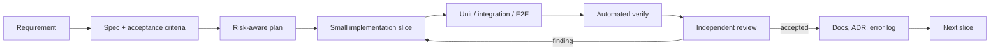

# Engineering handbook

This directory is the durable project memory for humans and coding agents.

| Need                                       | Source of truth                                                            |
| ------------------------------------------ | -------------------------------------------------------------------------- |
| Original mentor brief                      | [`../feature.md`](../feature.md)                                           |
| Normalized scope and priorities            | [`product/feature-scope.md`](product/feature-scope.md)                     |
| API, events, cron, workers, CI/CD triggers | [`api/endpoint-catalog.md`](api/endpoint-catalog.md)                       |
| Runtime/component design                   | [`architecture/system-design.md`](architecture/system-design.md)           |
| Database schema and ERD                    | [`architecture/database.md`](architecture/database.md)                     |
| Editable Draw.io database diagram          | [`architecture/hotel-database.drawio`](architecture/hotel-database.drawio) |
| Delivery phases                            | [`delivery/roadmap.md`](delivery/roadmap.md)                               |
| Test strategy and definition of done       | [`quality/test-strategy.md`](quality/test-strategy.md)                     |
| Durable technical decisions                | [`decisions/`](decisions/)                                                 |
| Reusable failures and prevention           | [`logs/error-log.md`](logs/error-log.md)                                   |
| Specs, plans, and review reports           | [`templates/`](templates/)                                                 |

## Harness loop

Active work should live under `docs/specs/`, `docs/plans/`, and `docs/reviews/` when
implementation begins. Create files from the templates; do not use a single mutable
"current plan" that loses history.
