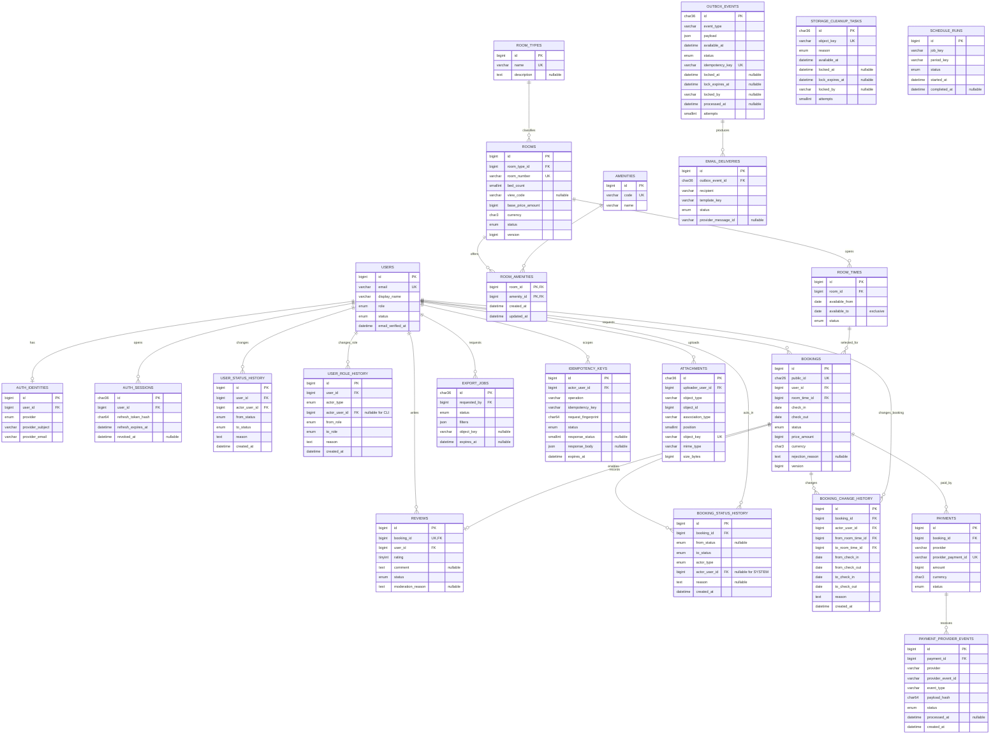

# Database design (MySQL 8)

Editable mentor-review diagram: [`hotel-database.drawio`](hotel-database.drawio).
Open it with the diagrams.net web app or Draw.io desktop. Page 1 contains the core
domain ERD; page 2 separates asynchronous/operational persistence so the main model
remains readable.

This is the target logical model. Required/selected tables are built before tables
marked optional. All mutable tables include `created_at` and `updated_at` unless the
table is append-only.

## Constraints and indexes

| Table                     | Required constraint/index                                                        |
| ------------------------- | -------------------------------------------------------------------------------- |
| `users`                   | unique normalized `email`; indexes on `(status, role)`                           |
| `auth_identities`         | unique `(provider, provider_subject)` and `(user_id, provider)`                  |
| `auth_sessions`           | `(user_id, revoked_at)`, `refresh_expires_at`                                    |
| `user_status_history`     | `(user_id, created_at)`; append-only; same transaction as status update          |
| `user_role_history`       | `(user_id, created_at)`; append-only; same transaction as role update            |
| `rooms`                   | unique `room_number`; indexes `(status, room_type_id)`, `bed_count`, `view_code` |
| `room_amenities`          | composite PK plus reverse index `(amenity_id, room_id)`                          |
| `room_times`              | `CHECK (available_from < available_to)`; `(room_id, status, available_from)`     |
| `bookings`                | `CHECK (check_in < check_out)`; window/date/status and user/date indexes         |
| `booking_status_history`  | `(booking_id, created_at)`; no updates/deletes in application                    |
| `booking_change_history`  | `(booking_id, created_at)`; append-only; stores window/date before and after     |
| `attachments`             | unique object key and `(object_type, object_id, association_type, position)`     |
| `storage_cleanup_tasks`   | unique object key; claim index `(available_at, lock_expires_at)`                 |
| `reviews`                 | unique `booking_id`; check `rating BETWEEN 1 AND 5`                              |
| `payment_provider_events` | unique `(provider, provider_event_id)`; index `(payment_id, created_at)`         |
| `outbox_events`           | unique `idempotency_key`; claim index `(status, available_at, lock_expires_at)`  |
| `email_deliveries`        | unique `(outbox_event_id, recipient, template_key)`                              |
| `idempotency_keys`        | unique `(actor_user_id, operation, idempotency_key)`; index `expires_at`         |
| `schedule_runs`           | unique `(job_key, period_key)` for cron idempotency                              |

MySQL cannot express either interval rule as a simple unique constraint. Creating or
changing a `room_times` row locks its physical room and rejects overlap with another
active window; adjacent windows are valid. A requested stay must be fully contained
in exactly one active window. `BOOK-01` locks the physical room before resolving and
locking that window, revalidates containment, and retains the locks until the booking,
initial status history, and idempotency record commit. The server stores the resolved
`bookings.room_time_id`; it never trusts a client-supplied window ID.

All nested window mutations query both `room_times.id` and `room_times.room_id` from
the URL. Once any booking or `booking_change_history` references a window, its dates
are immutable; create a replacement window instead. Deactivation is rejected while
the window has `PENDING` or `CONFIRMED` bookings. Hard deletion requires no booking
or change-history reference, while a historical unused-for-future window remains
available for deactivation.

The approval transaction locks the physical room and referenced window, verifies the
window remains active and contains the stay, then queries overlapping `CONFIRMED`
bookings across every window of that room before transition/history/outbox commit.
This room-wide query preserves the invariant even if legacy data contains overlapping
windows.

`ADMIN-BOOK-05` accepts only `PENDING` or `CONFIRMED`. Pre-read candidate room IDs,
lock old/new physical rooms in ascending ID order, then lock/re-read the booking and
source window. Abort on version/source drift. Under those locks, resolve/lock/
revalidate the destination window. The confirmed-overlap query excludes the booking
being edited. The booking update, append-only `booking_change_history`, and
notification outbox event commit atomically.

An API idempotency record is created in the same transaction as its resource. A key
reused with a different request fingerprint is rejected; a completed identical
request returns the stored status/body. Expired rows are removed by `CRON-01`.

Outbox workers claim rows with a short lease using `SELECT ... FOR UPDATE SKIP
LOCKED`, increment attempts, and recover rows whose lease expired after a crash. The
outbox key prevents duplicate logical events; the email-delivery unique key prevents
duplicate logical deliveries across retries.

For the optional payment slice, a verified webhook first inserts its provider event
into `payment_provider_events`. The unique provider/event key makes a retry a no-op;
the ledger row and payment transition commit in one transaction. Store a payload hash
and normalized processing result rather than credentials or an unnecessary raw body.

`attachments` deliberately uses polymorphic `(object_type, object_id)` because room
thumbnail/album and optional user avatar share one file lifecycle. MySQL cannot
enforce the target FK, so an allowlisted resolver validates target existence,
authorization, and allowed pairs (`ROOM+THUMBNAIL`, `ROOM+ALBUM`, `USER+AVATAR`)
under a locked target row in the metadata transaction. Target deletion follows the
same lock protocol. Every read/update/delete matches attachment ID plus target type
and ID, preventing cross-object mutation. Singleton types use position `0`; album
reorder validates the complete target-bound ID set and uses a collision-safe bulk or
temporary-position update atomically. A bounded reconciliation job detects orphan
metadata/cloud objects. Deactivation preserves media; only hard deletion detaches it.
The Draw.io ERD therefore uses a dashed `rooms -> attachments` connector labelled
`logical ROOM target (no FK)`; it documents the application relation without
pretending MySQL can enforce it. See ADR-0003.

`storage_cleanup_tasks` closes the object-upload/database-commit crash gap without
activating the general notification outbox early. Before a provider upload, the API
inserts a unique object-key safeguard whose `available_at` is later than the bounded
storage timeout. The target-locked attachment transaction deletes that safeguard as
it inserts live metadata. If upload or metadata work fails, the safeguard eventually
becomes claimable and deleting a nonexistent object remains safe. Attachment detach
or replacement inserts immediately available cleanup work in its metadata
transaction. Claimers use expiring lock fields and increment `attempts`; the lock
columns are either all null or all populated. Phase 7 may schedule this same bounded
cleanup service, while Phase 5's general outbox remains independent.

The first-admin CLI identifies one already-provisioned account using both `user_id`
and its matching normalized verified email. It rejects missing/inactive/mismatched
accounts. Promotion and the append-only `user_role_history` row commit atomically;
rerunning for the same `ADMIN` is an explicit no-op, never a silent reassignment.

## Booking state machine

- `PENDING -> CONFIRMED | REJECTED | CANCELLED_BY_USER | CANCELLED_BY_ADMIN`.
- `CONFIRMED -> CANCELLED_BY_ADMIN | COMPLETED`.
- `CRON-03` transitions confirmed stays with `check_out <= hotel local date` to
  `COMPLETED` in bounded idempotent batches. This enables optional review eligibility.
- Terminal states do not transition. Every successful transition and its actor are
  appended in the same transaction; system actors use `actor_type=SYSTEM` and null
  `actor_user_id`.

## Statuses

- User: `ACTIVE`, `INACTIVE`.
- Room: `ACTIVE`, `INACTIVE`, `MAINTENANCE`.
- Room time: `ACTIVE`, `INACTIVE`.
- Booking: `PENDING`, `CONFIRMED`, `REJECTED`, `CANCELLED_BY_USER`, `CANCELLED_BY_ADMIN`, `COMPLETED`.
- Review: `PENDING`, `APPROVED`, `REJECTED` (optional).
- Payment: `PENDING`, `CAPTURED`, `FAILED`, `REFUNDED` (optional).

Use restrictive foreign keys for financial/history records. Prefer deactivation to
deletion. A room-time row with booking history is deactivated, not deleted. Room
deletion is rejected when bookings exist through any of its room-time rows.
