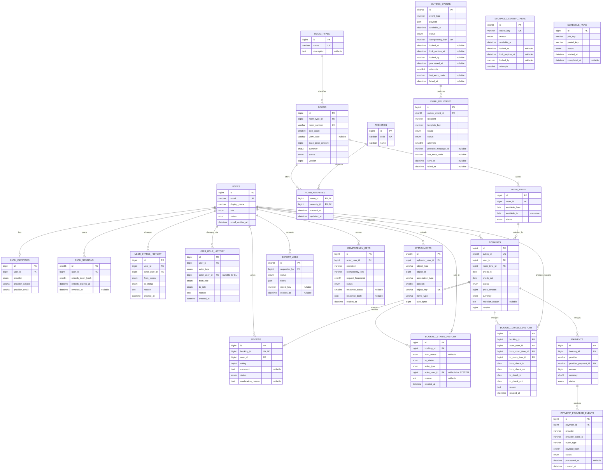

# Database design (MySQL 8)

Editable mentor-review diagram: [`hotel-database.drawio`](hotel-database.drawio).
Open it with the diagrams.net web app or Draw.io desktop. Page 1 contains the core
domain ERD; page 2 separates asynchronous/operational persistence so the main model
remains readable.

This is the target logical model. Required/selected tables are built before tables
marked optional. All mutable tables include `created_at` and `updated_at` unless the
table is append-only.

## Constraints and indexes

| Table                     | Required constraint/index                                                                                                                                                                                                       |
| ------------------------- | ------------------------------------------------------------------------------------------------------------------------------------------------------------------------------------------------------------------------------- |
| `users`                   | unique normalized `email`; indexes on `(status, role)`                                                                                                                                                                          |
| `auth_identities`         | unique `(provider, provider_subject)` and `(user_id, provider)`                                                                                                                                                                 |
| `auth_sessions`           | `(user_id, revoked_at)`, `refresh_expires_at`                                                                                                                                                                                   |
| `user_status_history`     | `(user_id, created_at)`; append-only; same transaction as status update                                                                                                                                                         |
| `user_role_history`       | `(user_id, created_at)`; append-only; same transaction as role update                                                                                                                                                           |
| `rooms`                   | unique `room_number`; indexes `(status, room_type_id)`, `bed_count`, `view_code`                                                                                                                                                |
| `room_amenities`          | composite PK plus reverse index `(amenity_id, room_id)`                                                                                                                                                                         |
| `room_times`              | `CHECK (available_from < available_to)`; `(room_id, status, available_from)`. A status-leading index is deliberately absent: the overlap read locks through this index, so a global one would spread its gap locks across rooms |
| `bookings`                | `CHECK (check_in < check_out)` and safe-integer `price_amount`; unique public ULID plus window/date/status and user/date indexes                                                                                                |
| `booking_status_history`  | `(booking_id, created_at)`; no updates/deletes in application                                                                                                                                                                   |
| `booking_change_history`  | `(booking_id, created_at)`; append-only; stores window/date before and after                                                                                                                                                    |
| `attachments`             | unique object key and `(object_type, object_id, association_type, position)`                                                                                                                                                    |
| `storage_cleanup_tasks`   | unique object key; claim index `(available_at, lock_expires_at)`                                                                                                                                                                |
| `reviews`                 | unique `booking_id`; check `rating BETWEEN 1 AND 5`                                                                                                                                                                             |
| `payment_provider_events` | unique `(provider, provider_event_id)`; index `(payment_id, created_at)`                                                                                                                                                        |
| `outbox_events`           | unique `idempotency_key`; claim index `(status, available_at, lock_expires_at)`; lease, processed-time, and terminal failure shape is checked                                                                                   |
| `email_deliveries`        | unique `(outbox_event_id, template_key)`; operations index `(status, created_at, id)`; backlog-aggregate index `(template_key, status)`; restrictive FK to `outbox_events`; sent/failed shape is checked                        |
| `email_send_attempts`     | append-only provider acceptances; index `(outbox_event_id, accepted_at)`; deliberately **no** FK to `outbox_events`, because an FK insert takes a shared lock on the very row a recovering worker may hold exclusively          |
| `idempotency_keys`        | unique `(actor_user_id, operation, idempotency_key)`; index `expires_at`; pending/completed response shape is checked                                                                                                           |
| `schedule_runs`           | unique `(job_key, period_key)` for cron idempotency                                                                                                                                                                             |

## Phase 4 persistence contract

`CreateBookingCoreSchema1788580000000` creates the first five Phase 4 tables:
`bookings`, `booking_status_history`, `booking_change_history`,
`idempotency_keys`, and `outbox_events`. It is additive on the accepted Phase 2/3
schema and uses restrictive foreign keys; production rollback is a compatible
forward fix after its first write.

`bookings.public_id` is an ASCII `CHAR(26)` public ULID while joins retain internal
unsigned `BIGINT` keys. Price snapshots are unsigned integer minor units bounded to
the JavaScript-safe range, and all stay dates are MySQL `DATE` values represented as
UTC-safe `YYYY-MM-DD` strings by TypeORM. Booking statuses are `PENDING`,
`CONFIRMED`, `REJECTED`, `CANCELLED_BY_USER`, `CANCELLED_BY_ADMIN`, and
`COMPLETED`; history tables are append-only and therefore omit `updated_at`.

An `idempotency_keys` row is either `PENDING` with neither stored response field, or
`COMPLETED` with both `response_status` and `response_body`. The unique actor /
operation / key tuple lets the creation transaction store and replay one exact result.
Expired records are retained until the Phase 7 cleanup owner runs; retaining longer
than the configured minimum is safe because it only refuses a changed reuse.

An `outbox_events` row is exactly one of: `PENDING` with no lease, processed time, or
failure time; `PROCESSING` with a complete lease; `PROCESSED` with a processed time
and no failure evidence; or `FAILED` with a failure time and a stable error code.
The unique logical event key prevents duplicate notification intent. Phase 4 writes
these rows atomically with booking state; Phase 5 claims them using `FOR UPDATE SKIP
LOCKED` and performs delivery.

## Phase 5 notification persistence contract

Three additive migrations. `CreateNotificationDeliverySchema1789370000000` ships the
delivery record; `CreateEmailSendAttemptSchema1789460000000` adds the acceptance
evidence `P5-T07` found the first one could not carry; `AddDeliveryBacklogIndex1789550000000`
covers the backlog aggregate the operator alerts on.

`AddDeliveryBacklogIndex1789550000000` is the only one of the three that reverts
unconditionally. It adds `(template_key, status)` and nothing else, so it destroys no
evidence when dropped - the aggregate simply returns to scanning the clustered index.
The backlog sampler groups on those two columns in that order and selects no third,
which makes the read a covering index scan; a query change that selects another column
silently gives that up. The write cost is one index insert per delivery plus one index
update when the row leaves `PENDING`, because `status` is part of the key.

`CreateNotificationDeliverySchema1789370000000` is additive on Phase 4. It widens the
outbox lifecycle with the terminal `FAILED` state plus `last_error_code` and
`failed_at`, and creates `email_deliveries`. Every Phase 4 row shape stays valid.

`last_error_code` holds a stable classifier code, never provider text: it survives on
a `PENDING` row so an operator can see why a retry is scheduled, is cleared by
success, and is required by the terminal state. A `FAILED` event keeps no lease, so a
terminal failure cannot look like work someone still owns.

`email_send_attempts` is append-only and never updated. It records that a provider
accepted a message, with the claim token that was sending and the attempt number. It
exists because the delivery row is owned by whoever holds the outbox claim, while the
worker that most needs to write "the mail is out" is the one that has just found its
claim gone: without a place to put that fact, a message the guest already received
could later be marked `FAILED` and redriven into a duplicate. Appending conflicts with
no owner, which is also why it carries no foreign key - an FK insert would take a
shared lock on the parent row a recovering worker may hold exclusively, making the one
write that must not wait the write that waits. The redrive command refuses an event
with a recorded acceptance unless an operator overrides it explicitly.

An `email_deliveries` row is the one logical delivery for an outbox event and a
template. The worker locks or creates it before calling the provider, so a duplicate
job, a recovered lease, and a later retry all resolve to the same row. The recipient
is a snapshot held outside the unique key on purpose: inside it, a retry that
re-resolved a changed owner address would insert a second row and send a second
message, which is the duplicate the record exists to prevent;
`attempts` is cumulative across them and a redrive preserves it. The row is `PENDING`
with no result and no provider message id, `SENT` with an acceptance time and no error
code, or `FAILED` with a failure time and a code. Rendered bodies and provider error
strings are deliberately absent: neither is delivery evidence and both carry content.

The restrictive foreign key means delivery evidence cannot be orphaned by removing the
event that caused it. The migration's `down` refuses to run once any delivery or
terminal failure exists, because reverting would destroy the only record of what was
or was not sent; after that point a deployment rolls the application back to a
schema-compatible version or fixes forward.

## Phase 6 export persistence contract

One additive migration, `CreateRoomExportSchema1789640000000`. It creates
`export_jobs` and adds `idx_outbox_events_claim_by_type` to `outbox_events`. No Phase
4 or Phase 5 row shape changes, and nothing existing reads the new table, so it can be
applied ahead of the code that uses it - which is what the rollout asks for.

`export_jobs` is written by two processes on different schedules: the API creates the
row inside the same transaction as the idempotency response and the outbox event, and
the worker finishes it after generation and upload. The check constraints are there
because of that split. `chk_export_jobs_state_shape` makes a `COMPLETED` row carry a
whole result - object key, row count, byte count, content hash, start, completion and
expiry - and no failure evidence, while a `FAILED` row carries a stable error code and
a failure time and no result at all. A half-written completion is exactly the shape
that would hand an administrator a download URL for an object that was never uploaded.
`chk_export_jobs_result_bounds` caps the two counts at 2^53 - 1: `BIGINT UNSIGNED`
already excludes negatives, but a larger value reaches the API as a rounded JavaScript
number, so MySQL would accept a figure that becomes a different figure by the time an
administrator reads it.

The unique `outbox_event_id` is the proof that one job has exactly one durable
trigger; two jobs sharing an event would be two workers generating from one claim.
Both foreign keys are `RESTRICT`, because the outbox event is the job's trigger and
the requester is its permanent owner - deleting either while a job references it would
leave a result whose provenance cannot be established, which is worse than a refused
delete an operator has to think about. `filters` is the normalized snapshot taken at
request time, stored once, never reread from the client, and never interpolated into
SQL. `object_key` is server-generated and is never returned to a client or written to
a log.

`EXPIRED` is not a stored status. It is a read-time view of a `COMPLETED` row whose
`expires_at` has passed, compared against database time rather than an API host's
clock. Storing it would need a scheduler Phase 6 does not have, and a result that is
only expired once something remembered to say so is one the API would keep handing out
in the meantime. Phase 7 owns the durable deletion of expired objects and rows.

### Two consumers, one outbox

Phase 6 puts a second event family in `outbox_events`, and the Phase 5 dispatcher
claimed by status and availability alone - nothing in it said "mail". The event-type
allowlist is therefore a claim invariant rather than a consumer check: every
claim, release, renewal, finalize, failure and backlog statement carries
`event_type IN (...)`, in SQL, before `LIMIT`. Filtering a claimed batch afterwards
would not be equivalent, because the wrong consumer would already hold the lease and
the row would be invisible to its real owner until that lease expired - a stall that
looks exactly like a stuck worker.

`idx_outbox_events_claim_by_type` leads on `event_type`, so a single-family dispatcher

- which the export consumer is - gets an ordered range scan with no sort. The
  notification claim filters four types and is expected to stay on
  `idx_outbox_events_claim`, whose leading `status` still yields `available_at` order
  directly; a multi-value `IN` on a leading column could not. Both indexes therefore
  remain until `EXPLAIN` against a mixed and a skewed backlog decides otherwise, which
  is why the migration adds an index rather than replacing one.

The migration's `down` drops the index and the table, and is allowed only before the
first export job exists. After activation it would destroy the rows that prove which
object belongs to whom, so the documented rollback is a schema-compatible application
version or a forward fix.

## Connection and concurrency bounds

`MYSQL_POOL_SIZE` (default `10`) sets the mysql2 pool's `connectionLimit`. Every
locking write holds a connection from the first `SELECT ... FOR UPDATE` to commit,
and public catalog/availability reads hold one for the duration of their consistent
snapshot, so the pool is the effective limit on concurrent request work rather than
a tuning detail: exhausting it queues requests instead of failing them. Size it so
all API instances plus the CLI runners (`auth:bootstrap-admin`,
`files:storage-cleanup`) stay below the server's `max_connections`, and keep it
larger than the number of connections one request can need at once.

Acquisition is bounded, not unbounded. mysql2 queues connection requests without
limit and has no acquire timeout, so a saturated pool would otherwise hold every
caller — including the readiness probe — until a connection frees. The pool therefore
allows four waiters per connection (`queueLimit = MYSQL_POOL_SIZE * 4`) and refuses
beyond that with `503 DATABASE_OVERLOADED`, a stable localized code that says the
request was valid and may be retried. Sustained saturation also turns readiness red,
which is the intended shed-load signal rather than a defect: the instance is telling
the orchestrator it cannot serve, instead of silently queueing traffic behind a full
pool. The depth is derived from the pool so there is one knob, not two.

## Temporal storage contract

MySQL's default and every application session use UTC. Local Compose pins
`--default-time-zone=+00:00`; managed environments must configure the equivalent
server/session setting and verify it before serving traffic. The mysql2 connection
uses `timezone: 'Z'` so UTC `DATETIME(6)` audit values hydrate as instants.

Hotel stay/window values remain timezone-free MySQL `DATE` columns represented as
`YYYY-MM-DD` strings. Those columns also declare TypeORM `utc: true`: the server UTC
setting controls database temporal operations, while the column option prevents an
application host west of UTC from formatting a driver-hydrated date one day early.
Both safeguards are required.

MySQL cannot express either interval rule as a simple unique constraint. Creating or
changing a `room_times` row locks its physical room and rejects overlap with another
active window; adjacent windows are valid. A requested stay must be fully contained
in exactly one active window. `BOOK-01` locks the physical room before resolving and
locking that window, revalidates containment, and retains the locks until the booking,
initial status history, and idempotency record commit. The server stores the resolved
`bookings.room_time_id`; it never trusts a client-supplied window ID.

All nested window mutations query both `room_times.id` and `room_times.room_id` from
the URL. Once any booking or `booking_change_history` references a window, its dates
are immutable; create a replacement window instead. Deactivation is rejected while
the window has `PENDING` or `CONFIRMED` bookings. Hard deletion requires no booking
or change-history reference, while a historical unused-for-future window remains
available for deactivation.

The approval transaction locks the physical room and referenced window, verifies the
window remains active and contains the stay, then queries overlapping `CONFIRMED`
bookings across every window of that room before transition/history/outbox commit.
This room-wide query preserves the invariant even if legacy data contains overlapping
windows.

`ADMIN-BOOK-05` accepts only `PENDING` or `CONFIRMED`. Pre-read candidate room IDs,
lock old/new physical rooms in ascending ID order, then lock/re-read the booking and
source window. Abort on version/source drift. Under those locks, resolve/lock/
revalidate the destination window. The confirmed-overlap query excludes the booking
being edited. The booking update, append-only `booking_change_history`, and
notification outbox event commit atomically.

An API idempotency record is created in the same transaction as its resource. A key
reused with a different request fingerprint is rejected; a completed identical
request returns the stored status/body. Expired rows are removed by `CRON-01`.

Outbox workers claim rows with a short lease using `SELECT ... FOR UPDATE SKIP
LOCKED`, increment attempts, and recover rows whose lease expired after a crash. The
outbox key prevents duplicate logical events; the email-delivery unique key prevents
duplicate logical deliveries across retries.

For the optional payment slice, a verified webhook first inserts its provider event
into `payment_provider_events`. The unique provider/event key makes a retry a no-op;
the ledger row and payment transition commit in one transaction. Store a payload hash
and normalized processing result rather than credentials or an unnecessary raw body.

`attachments` deliberately uses polymorphic `(object_type, object_id)` because room
thumbnail/album and optional user avatar share one file lifecycle. MySQL cannot
enforce the target FK, so an allowlisted resolver validates target existence,
authorization, and allowed pairs (`ROOM+THUMBNAIL`, `ROOM+ALBUM`, `USER+AVATAR`)
under a locked target row in the metadata transaction. Target deletion follows the
same lock protocol. Every read/update/delete matches attachment ID plus target type
and ID, preventing cross-object mutation. Singleton types use position `0`; album
reorder validates the complete target-bound ID set and uses a collision-safe bulk or
temporary-position update atomically. A bounded reconciliation job detects orphan
metadata/cloud objects. Deactivation preserves media; only hard deletion detaches it.
The Draw.io ERD therefore uses a dashed `rooms -> attachments` connector labelled
`logical ROOM target (no FK)`; it documents the application relation without
pretending MySQL can enforce it. See ADR-0003.

`storage_cleanup_tasks` closes the object-upload/database-commit crash gap without
activating the general notification outbox early. Before a provider upload, the API
inserts a unique object-key safeguard whose `available_at` is later than the bounded
storage timeout. The target-locked attachment transaction deletes that safeguard as
it inserts live metadata. If upload or metadata work fails, the safeguard eventually
becomes claimable and deleting a nonexistent object remains safe. Attachment detach
or replacement inserts immediately available cleanup work in its metadata
transaction. Claimers use expiring lock fields and increment `attempts`; the lock
columns are either all null or all populated. Phase 7 may schedule this same bounded
cleanup service, while Phase 5's general outbox remains independent.

The first-admin CLI identifies one already-provisioned account using both `user_id`
and its matching normalized verified email. It rejects missing/inactive/mismatched
accounts. Promotion and the append-only `user_role_history` row commit atomically;
rerunning for the same `ADMIN` is an explicit no-op, never a silent reassignment.

## Booking state machine

- `PENDING -> CONFIRMED | REJECTED | CANCELLED_BY_USER | CANCELLED_BY_ADMIN`.
- `CONFIRMED -> CANCELLED_BY_ADMIN | COMPLETED`.
- `CRON-03` transitions confirmed stays with `check_out <= hotel local date` to
  `COMPLETED` in bounded idempotent batches. This enables optional review eligibility.
- Terminal states do not transition. Every successful transition and its actor are
  appended in the same transaction; system actors use `actor_type=SYSTEM` and null
  `actor_user_id`.

## Statuses

- User: `ACTIVE`, `INACTIVE`.
- Room: `ACTIVE`, `INACTIVE`, `MAINTENANCE`.
- Room time: `ACTIVE`, `INACTIVE`.
- Booking: `PENDING`, `CONFIRMED`, `REJECTED`, `CANCELLED_BY_USER`, `CANCELLED_BY_ADMIN`, `COMPLETED`.
- Review: `PENDING`, `APPROVED`, `REJECTED` (optional).
- Payment: `PENDING`, `CAPTURED`, `FAILED`, `REFUNDED` (optional).

Use restrictive foreign keys for financial/history records. Prefer deactivation to
deletion. A room-time row with booking history is deactivated, not deleted. Room
deletion is rejected when bookings exist through any of its room-time rows.
