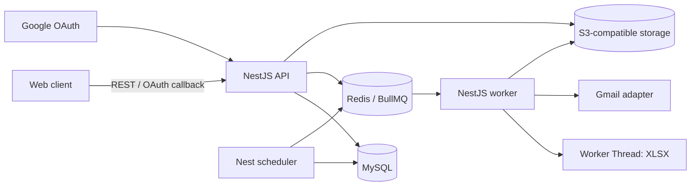

# System design

## Recommended baseline

- NestJS modular monolith, REST under `/api/v1`, OpenAPI/Swagger.
- MySQL + TypeORM migrations; Redis for BullMQ and short-lived data.
- S3-compatible object storage (MinIO locally, cloud bucket in deployed environments).
- Gmail-backed mail adapter in deployment and Mailpit locally.
- One API process and one worker process from the same image. The queue worker handles
  email and export orchestration; a Node Worker Thread performs only CPU-heavy XLSX
  generation. Network/database work remains in the queue process.
- GitHub Actions-style CI/CD contract; the actual deploy provider is selected before
  implementation.

## Module boundaries

| Module          | Owns                                                                     |
| --------------- | ------------------------------------------------------------------------ |
| `auth`          | Google identity/JIT provisioning, JWT, rotating refresh sessions, guards |
| `users`         | Profile, status, role administration                                     |
| `rooms`         | Room/type/amenity catalog, bookable windows, search, availability        |
| `bookings`      | Request lifecycle, concurrency rules, price snapshots/history            |
| `reviews`       | Optional eligibility and moderation                                      |
| `payments`      | Optional checkout and verified webhook transitions                       |
| `files`         | Upload policy, object keys, cloud adapter, attachments                   |
| `notifications` | Outbox relay, templates, email deliveries/retries                        |
| `reports`       | Queries, export jobs, Worker Thread bridge                               |
| `scheduling`    | Singleton cron orchestration and run ledger                              |
| `health`        | Liveness/readiness for deploy gates                                      |

## Reliability and security

- Use an outbox row written in the booking transaction. Workers claim with expiring
  leases, recover abandoned claims, and deduplicate logical delivery by outbox,
  recipient, and template before marking the event processed.
- OAuth uses Authorization Code flow, PKCE where the client shape supports it, and
  exact redirect URI allowlists. The callback accepts an identity only after Google's
  published keys verify the ID-token signature with an explicit algorithm allowlist;
  `iss`, `aud`, `exp`/current time, one-time `nonce`, non-empty `sub`/`email`, and
  `email_verified=true` must all pass. The random OAuth `state` is also stored in a
  short-lived `HttpOnly; Secure` (production), `SameSite=Lax` cookie scoped to the
  callback path. The callback constant-time compares query state with that browser
  cookie, then atomically consumes the matching server transaction and nonce. Thus a
  valid state initiated in another browser is rejected. State/nonce transactions
  expire and are consumed whether the callback succeeds or fails; Google's code is
  exchanged once and never retried or logged.
- The application refresh token is opaque and lives only in a cookie with `HttpOnly`,
  `Secure` in deployed environments, a narrow auth `Path`, and `SameSite=Lax` when
  frontend and API are same-site. A cross-site deployment must instead use
  `SameSite=None; Secure`, an exact credentialed-CORS origin allowlist, and explicit
  CSRF protection (validated Origin plus a CSRF token) on refresh/logout. OAuth
  `state` protects the login initiation/callback flow.
- Refresh rotation locks the MySQL `auth_sessions` row, compares the stored hash in
  constant time, and replaces it in the same transaction. Presentation of an old or
  mismatched token revokes that session, so a stolen token cannot race indefinitely.
  Logout and inactivation revoke durable sessions and publish each session ID (`sid`)
  to Redis until its access JWT could no longer be valid. Every protected request
  verifies JWT claims and denies a revoked `sid`; login/refresh also recheck user
  status in MySQL. Redis stores only positive revocation entries: a cache miss or
  Redis outage falls back to the MySQL session/user status, and failure of both stores
  fails closed. A cache miss never means “active.” This gives immediate denial while
  MySQL remains the source of truth.
- Uploads enforce MIME signature, size/count limits, generated keys, and least-
  privilege bucket credentials. Polymorphic attachment targets are resolved through
  an allowlisted object/association registry before insert; orphan reconciliation is
  observable and idempotent. Prefer presigned download URLs for private exports.
- Rate-limit auth, booking creation, uploads, and export creation. Redact tokens,
  cookies, OAuth codes, and provider payloads from logs.
- Readiness verifies required dependencies; liveness verifies only the process.
- Run migrations as a separate deployment step, then deploy API/worker and perform
  a health check. Rollback must be compatible with forward-only schema changes.

## Local Docker Compose target

Services: `api`, `worker`, `mysql`, `redis`, `minio`, and `mailpit`. Use healthchecks,
named volumes, a non-root production image, and separate `.env.example` values. Do
not bundle secrets into the image or Compose file.
