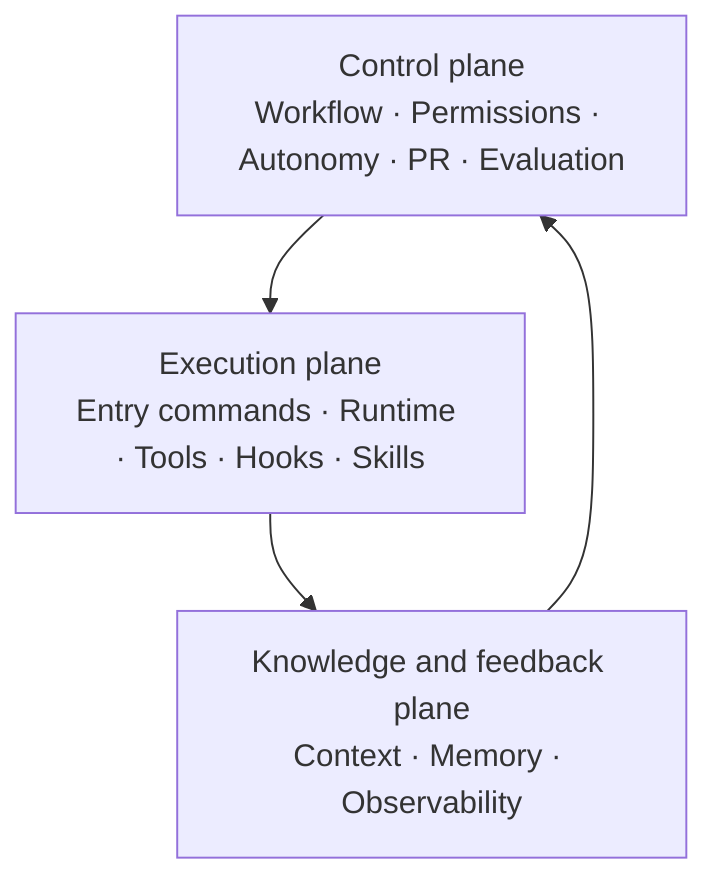
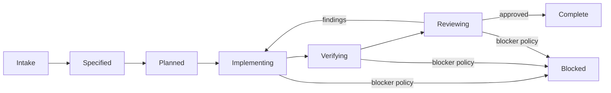

# Harness Architecture v0.1

- Status: Accepted
- Effective date: 2026-08-27
- Machine manifest: [`../../.harness/manifest.yaml`](../../.harness/manifest.yaml)
- Implementation spec: [`../specs/SPEC-001-executable-harness.md`](../specs/SPEC-001-executable-harness.md)

## Purpose and principles

The Harness is the runtime and control system around humans and coding agents. It
makes the safe delivery path discoverable, repeatable, observable, and enforceable.
It does not replace product architecture or grant authority beyond the current task.

Principles:

- One local/CI release gate: `npm run verify`.
- Progressive context loading instead of loading every document.
- Machine configuration is executable only when a checked-in consumer exists.
- Planned tools are labelled `planned`; they are never presented as operational.
- Human-authored policy stays human-authored. YAML references it but does not generate
  or silently override it.
- Autonomy never overrides permissions, approval, or destructive-action safeguards.

## Three-plane model

## Component map

| Component                 | Source of truth             | Operational mechanism                                        |
| ------------------------- | --------------------------- | ------------------------------------------------------------ |
| 1. Entry commands         | `.harness/manifest.yaml`    | npm scripts and cross-platform `scripts/verify.mjs`          |
| 2. Workflow/state machine | manifest + `AGENTS.md`      | status in feature plans and review gates                     |
| 3. Context strategy       | manifest + `docs/README.md` | repository skill routes only relevant sources                |
| 4. Tool registry          | manifest                    | active/planned tools with permissions, evidence, and timeout |
| 5. Permission model       | manifest + `AGENTS.md`      | explicit approval boundaries; deny-by-default secrets        |
| 6. Hook lifecycle         | manifest                    | local handoff gate and GitHub Actions PR hook                |
| 7. Skill boundaries       | manifest + `.agents/skills` | one routing skill; specialization only after repetition      |
| 8. Memory model           | manifest + `docs/`          | specs, plans, ADRs, reviews, sanitized error lessons         |
| 9. Observability          | manifest                    | command output and GitHub check summaries; runtime planned   |
| 10. Evaluation strategy   | manifest + tests            | self-check, validator regressions, full repository gate      |
| 11. PR lifecycle          | manifest + `.github`        | locked install, verify, independent review, findings closure |
| 12. Autonomy levels       | manifest                    | L0–L4 profiles constrained by action permissions             |
| 13. Runtime contract      | manifest + `.nvmrc`         | Node/npm/lockfile now; Compose/deploy explicitly planned     |

## Entry commands

| Command                 | Use                                        | Side effect                           |
| ----------------------- | ------------------------------------------ | ------------------------------------- |
| `npm ci`                | Clean dependency bootstrap                 | Replaces `node_modules` from lockfile |
| `npm run harness:check` | Validate manifest and referenced artifacts | None                                  |
| `npm run test:harness`  | Regress the validator                      | Temporary OS/test output only         |
| `npm run verify`        | Required local and CI gate                 | Ignored test/build artifacts          |
| `npm run start:dev`     | Run current API locally                    | Starts a local process                |

Adding another canonical entry command requires a package script or the single
allowlisted bootstrap command, a tool reference, permission, side-effect category,
active environments, and validator coverage.

## Workflow and transition gates

The active plan is the durable state record. A transition is evidence-based: spec,
plan, scoped diff, checks, independent review, and findings disposition. A passing
build alone cannot move work to complete.

## Context and memory

`AGENTS.md` defines precedence. `docs/README.md` routes the task to the smallest
relevant source set. The repository skill implements that routing for coding agents.

Memory has distinct lifecycles:

- Normalized scope describes current product intent; superseded input remains
  recoverable from Git history rather than active project memory.
- Specs describe accepted observable outcomes.
- Plans record delivery state and temporary implementation choices.
- ADRs retain durable decisions and are superseded, not silently rewritten.
- Review reports retain evidence and finding disposition.
- Error log records verified reusable lessons, never speculative debugging notes.

Secrets, raw tokens/provider payloads, and unsanitized incident data are prohibited
from repository memory.

## Tools, permissions, and autonomy

Tools declare status, permission, and timeout. `planned` means unavailable and must
not be invoked or documented as working. Adding an MCP/plugin requires a demonstrated
gap, explicit permission review, and a maintained consumer.

| Level | Meaning                        | Typical work                         |
| ----- | ------------------------------ | ------------------------------------ |
| L0    | Read only                      | Explain, diagnose, review            |
| L1    | Plan                           | Write scoped spec/plan               |
| L2    | Local implementation (default) | Edit repository and run local checks |
| L3    | Non-production operations      | Planned: approved staging workflow   |
| L4    | Production-sensitive           | Planned: human-controlled deployment |

An autonomy profile is not authorization. For example, L4 still requires approval
for production deploy and cannot read or expose secrets.

## Hooks and PR lifecycle

Hooks are visible, bounded, and fail closed:

- Manifest change or review preparation runs the Harness checks.
- Handoff runs `npm run verify`.
- Pull request/push to main installs locked dependencies and runs the same verify
  command in GitHub Actions. Third-party actions are pinned to immutable commits.
- CI uses read-only repository permissions and never calls real external providers.

Git hooks are intentionally absent in v0.1: they modify developer workflow and are
easy to bypass. Fast local commands plus the CI workflow are the source of truth.
Add a hook manager only if measured feedback latency warrants it.

### GitHub merge protection

The repository can define the workflow, but only GitHub repository settings can make
it a mandatory merge gate. `.harness/manifest.yaml` therefore records this control as
`external_not_verified` until the owner verifies it. In GitHub, create a branch
ruleset for `main` with:

1. Require a pull request before merging and at least one approval.
2. Require status checks to pass and select `Verify repository`.
3. Require branches to be up to date before merging.
4. Block force pushes and branch deletion.

After confirming the active ruleset, change `merge_enforcement.status` to `verified`
in `.harness/manifest.yaml`; the validator continues checking that the named workflow exists
and runs the canonical `npm run verify` command. Independent reviewer assignment is
still a documented process in v0.1 unless a GitHub ruleset/CODEOWNERS policy enforces
it externally.

## Evaluation and observability

The validator applies the JSON Schema, then checks cross-references, active capability
evidence, exact npm entry commands, repository path containment (including symlinks),
runtime/engine agreement, and the CI invocation. It never executes YAML commands.
Negative Node tests mutate every major section and guard these failure paths.

Harness v0.1 actively emits command start/failure/completion records to terminal and
GitHub check output. Workflow state and review findings are manual document events.
Application request IDs, structured logs, health dependency evidence, queue metrics,
and cron metrics are planned for their roadmap phases.

Harness-authored events contain only allowlisted names, status, exit code, and error
reason. The gate streams child-process output instead of capturing and rewriting it;
application and test code therefore remain responsible for never logging secrets.

## Artifact ownership and generation policy

| Artifact                       | Ownership                                             |
| ------------------------------ | ----------------------------------------------------- |
| `AGENTS.md`                    | Hand-authored project policy                          |
| `docs/harness/architecture.md` | Hand-authored architecture and rationale              |
| `.harness/manifest.yaml`       | Machine-readable registry/policy data                 |
| `.harness/schema.json`         | Machine-enforced manifest shape                       |
| Validator and tests            | Hand-authored executable guardrail                    |
| Repository skill               | Hand-authored context/workflow router                 |
| CI workflow                    | Hand-authored security-sensitive hook                 |
| Specs/plans/reviews/errors     | Template-assisted, never content-generated            |
| MCP servers                    | Not created until an approved capability requires one |

Generation must be one-directional and validated. No artifact may regenerate its own
source or establish a second conflicting source of truth.

## Versioning and change process

`schema_version` changes when consumers need a breaking manifest change. For any
non-trivial Harness change:

1. Update spec/plan and architecture if semantics change.
2. Update manifest, consumer, and negative tests together.
3. Run focused Harness checks and `npm run verify`.
4. Obtain independent review and close findings.
5. Keep the change isolated from hotel feature implementation where practical.
