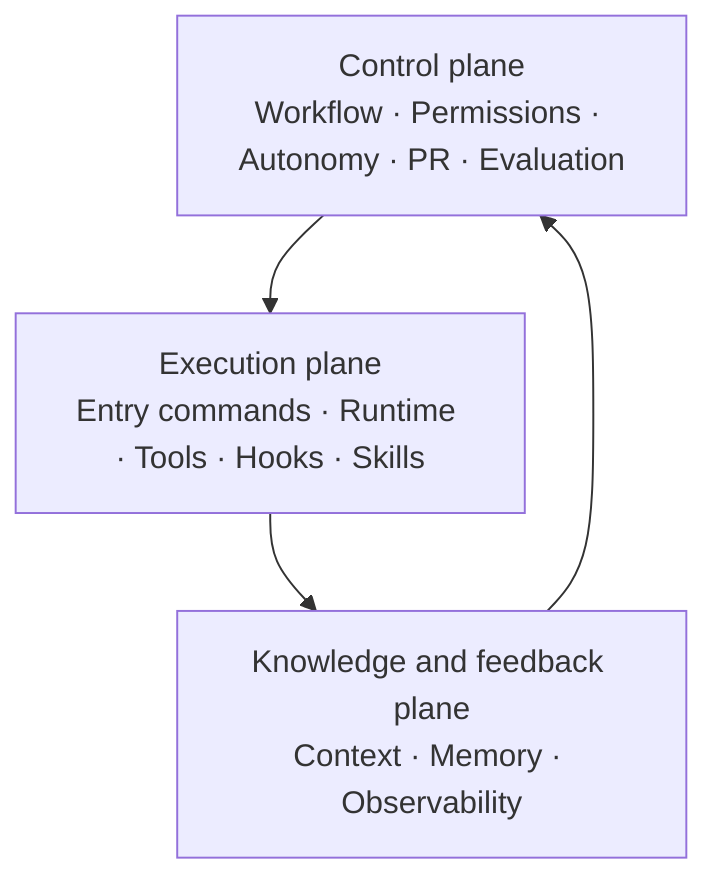
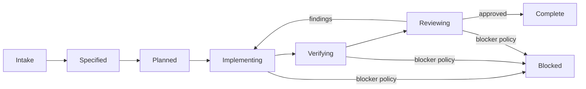

# Harness Architecture v0.2

- Status: Accepted
- Effective date: 2026-08-27
- Machine manifest: [`../../.harness/manifest.yaml`](../../.harness/manifest.yaml)
- Implementation spec: [`../specs/SPEC-002-harness-runtime-enforcement.md`](../specs/SPEC-002-harness-runtime-enforcement.md)

## Purpose and principles

The Harness is the runtime and control system around humans and coding agents. It
makes the safe delivery path discoverable, repeatable, observable, and enforceable.
It does not replace product architecture or grant authority beyond the current task.

Principles:

- One local/CI release gate: `npm run verify`.
- Progressive context loading instead of loading every document.
- Resolve permission and autonomy before every Harness-managed child process.
- Construct child environments from an allowlist rather than ambient inheritance.
- Machine configuration is executable only when a checked-in consumer exists.
- Planned tools are labelled `planned`; they are never presented as operational.
- Human-authored policy stays human-authored. YAML references it but does not generate
  or silently override it.
- Autonomy never overrides permissions, approval, or destructive-action safeguards.

## Three-plane model



## Component map

| Component                 | Source of truth             | Operational mechanism                                        |
| ------------------------- | --------------------------- | ------------------------------------------------------------ |
| 1. Entry commands         | `.harness/manifest.yaml`    | reviewed argv catalog and reference-only executor            |
| 2. Workflow/state machine | manifest + `AGENTS.md`      | status in feature plans and review gates                     |
| 3. Context strategy       | manifest `context_strategy` | deterministic task-class routes and bounded fallback         |
| 4. Tool registry          | manifest                    | active/planned tools with permissions, evidence, and timeout |
| 5. Permission model       | manifest + runtime module   | fail-closed pre-spawn decisions                              |
| 6. Hook lifecycle         | manifest                    | local handoff gate and GitHub Actions PR hook                |
| 7. Skill boundaries       | manifest + `.agents/skills` | one routing skill; specialization only after repetition      |
| 8. Memory model           | manifest + `docs/`          | specs, plans, ADRs, reviews, sanitized error lessons         |
| 9. Observability          | manifest + runtime module   | allowlisted JSON-lines decision/execution events             |
| 10. Evaluation strategy   | manifest + fixture suite    | offline behavioral fixtures and mutation tests               |
| 11. PR lifecycle          | manifest + `.github`        | locked install, verify, independent review, findings closure |
| 12. Autonomy levels       | manifest                    | L0–L4 profiles constrained by action permissions             |
| 13. Runtime contract      | manifest + `.nvmrc`         | Node/npm/lockfile/env boundary; deploy remains planned       |

## Entry commands

| Command                    | Use                                        | Side effect                           |
| -------------------------- | ------------------------------------------ | ------------------------------------- |
| `npm ci`                   | Restore exact committed dependency graph   | Replaces `node_modules` from lockfile |
| `npm run harness:check`    | Validate manifest and referenced artifacts | None                                  |
| `npm run test:harness`     | Regress validator/runtime/evaluator        | Temporary OS/test output only         |
| `npm run harness:eval`     | Run deterministic behavioral fixtures      | None                                  |
| `npm run verify`           | Required local and CI gate                 | Ignored test/build artifacts          |
| `npm run format:check`     | Non-mutating repository format check       | None                                  |
| `npm run lint:check`       | Non-mutating source lint check             | None                                  |
| `npm run test:unit`        | Unit test layer                            | Ignored test artifacts                |
| `npm run test:integration` | Integration test layer                     | Ignored test artifacts                |
| `npm run test:e2e`         | E2E test layer                             | Local test socket                     |
| `npm run build`            | Compile the application                    | Ignored build artifacts               |
| `npm run start:dev`        | Run current API locally                    | Starts a local process                |
| `npm run test:compose`     | Validate the dependency-stack contract     | None                                  |
| `npm run compose:config`   | Resolve and validate `compose.yaml`        | None                                  |
| `npm run compose:smoke`    | Exercise dependency health and persistence | Starts/restarts four local services   |

Adding another canonical entry command requires a package script or the single
allowlisted bootstrap command, a tool reference, permission, side-effect category,
active environments, and validator coverage.

## Runtime enforcement boundary

`scripts/harness-runtime.mjs` owns the enforced path:

```text
command_ref -> reviewed argv -> active tool/environment -> permission -> autonomy
            -> allowlisted child env -> spawn(shell: false) -> structured result
```

Manifest command text is display and drift-check data. It is cross-checked against an
implementation-owned argv catalog and is never passed to a shell. Unknown references,
planned tools/environments, denied actions, autonomy mismatches, and
`approval_required` without an approval artifact fail before spawn. Timeout and
non-zero exit fail the calling gate.

### Docker Compose boundary

The `docker_compose` tool is active only for the dependency-only local stack in
`compose.yaml`: MySQL, Redis, MinIO, and Mailpit. The resolver requires Compose v2 or
newer and supports both `docker compose` and the compatible standalone
`docker-compose` command. Images are pinned by tag and digest, published ports bind
to loopback, and named volumes preserve local development state.

`test:compose` and `compose:config` are non-mutating requirements of the local and CI
verification gate. Configuration validation requires a Compose CLI but does not
start a Docker daemon workload. The CI workflow starts only the MySQL dependency
through the reviewed `compose:ci` entrypoint before `verify` so the real TypeORM
integration and application E2E tests have their documented prerequisite; the runner
is disposable. `compose:smoke` remains an
explicitly mutating local check: it starts exactly the four dependencies, waits for
health, restarts Redis, and verifies a uniquely named persistence probe without
deleting volumes or stopping the stack.

Immutable pulls of the four digest-pinned dependency images are part of this local
boundary. Application-image build/publish, registry mutation, API/worker containers,
staging/production deployment, and TypeORM migration execution remain outside it and
retain planned status.

`bootstrap` has an additional `committed_dependency_graph` precondition. Before
`npm ci`, a fixed read-only Git probe requires both `package.json` and
`package-lock.json` to match `HEAD`; staged or unstaged graph changes fail before the
child starts. Dependency graph mutation therefore remains on the separate
approval-required path.

The child environment is the union of the cross-platform base allowlist, a
command-specific forwarding list, and four Harness-owned correlation fields. Both
allowlists are cross-checked against implementation-owned positive catalogs;
secret-like names and loader/runtime/package-manager control names such as
`NODE_OPTIONS`, `LD_PRELOAD`, and `NPM_CONFIG_USERCONFIG` are rejected. This controls
only children created by the Harness executor; it cannot constrain a developer who
invokes an executable directly.

For npm entrypoints, the reviewed argv invokes the trusted npm CLI under
`process.execPath`; it does not spawn `npm.cmd` or a shell. The CLI path must resolve
inside the active Node installation. This keeps the execution model consistent across
POSIX and Windows, while a dedicated Windows CI runner remains future confidence
coverage rather than a v0.2 merge dependency.

## Workflow and transition gates



The active plan is the durable state record. A transition is evidence-based: spec,
plan, scoped diff, checks, independent review, and findings disposition. A passing
build alone cannot move work to complete.

## Context and memory

`AGENTS.md` defines precedence. The canonical route registry is
`.harness/manifest.yaml` at `context_strategy.routes`. Callers supply stable task-class
ids; the selector returns the baseline plus only matching sources. Unmatched work gets
the bounded `repository_baseline` route rather than the full documentation tree.

`AGENTS.md`, `docs/README.md`, and the delivery skill contain the explicit marker
`HARNESS_CONTEXT_ROUTES_V0_2` and point back to the registry. The validator detects a
missing/stale marker and invalid/ambiguous source references. It does not parse the
semantics of free-form Markdown; detailed route tables are therefore not duplicated
in those mirrors.

Memory has distinct lifecycles:

- Normalized scope describes current product intent; superseded input remains
  recoverable from Git history rather than active project memory.
- Specs describe accepted observable outcomes.
- Plans record delivery state and temporary implementation choices.
- ADRs retain durable decisions and are superseded, not silently rewritten.
- Review reports retain evidence and finding disposition.
- Error log records verified reusable lessons, never speculative debugging notes.

Secrets, raw tokens/provider payloads, and unsanitized incident data are prohibited
from repository memory.

## Tools, permissions, and autonomy

Tools declare status, permission, and timeout. `planned` means unavailable and must
not be invoked or documented as working. Adding an MCP/plugin requires a demonstrated
gap, explicit permission review, and a maintained consumer.

| Level | Meaning                        | Typical work                          |
| ----- | ------------------------------ | ------------------------------------- |
| L0    | Observe and check              | Explain, diagnose, review, run checks |
| L1    | Plan                           | Write scoped spec/plan                |
| L2    | Local implementation (default) | Edit repository and run local checks  |
| L3    | Non-production operations      | Planned: approved staging workflow    |
| L4    | Production-sensitive           | Planned: human-controlled deployment  |

An autonomy profile is not authorization. For example, L4 still requires approval
for production deploy and cannot read or expose secrets.

## Hooks and PR lifecycle

Hooks are visible, bounded, and fail closed:

- Manifest change or review preparation runs the Harness checks.
- Handoff runs `npm run verify`.
- Pull request/push to main installs locked dependencies and runs the same verify
  command in GitHub Actions. Third-party actions are pinned to immutable commits.
- CI uses read-only repository permissions and never calls real external providers.
- CI validation permits exactly the reviewed `verify` job and its five known steps;
  job-level permission overrides and extra jobs/commands fail validation.

Git hooks are intentionally absent in v0.2: they modify developer workflow and are
easy to bypass. Fast local commands plus the CI workflow are the source of truth.
Add a hook manager only if measured feedback latency warrants it.

### GitHub merge protection

The repository can define the workflow, but only GitHub repository settings can make
it a mandatory merge gate. `.harness/manifest.yaml` therefore records this control as
`external_not_verified` until the owner verifies it. In GitHub, create a branch
ruleset for `main` with:

1. Require a pull request before merging and at least one approval.
2. Require status checks to pass and select `Verify repository`.
3. Require branches to be up to date before merging.
4. Block force pushes and branch deletion.

After confirming the active ruleset, change `merge_enforcement.status` to `verified`
in `.harness/manifest.yaml`; the validator continues checking that the named workflow exists
and runs the canonical `npm run verify` command. Independent reviewer assignment is
still a documented process in v0.2 unless a GitHub ruleset/CODEOWNERS policy enforces
it externally.

## Evaluation and observability

The validator applies the JSON Schema, then checks cross-references, active capability
evidence, exact npm entry commands, repository path containment (including symlinks),
runtime/engine agreement, and the CI invocation. It never executes YAML commands.
Negative Node tests mutate every major section and guard these failure paths.

`.harness/evaluations.yaml` adds ten offline fixtures for read/review, API/product,
persistence/concurrency, allowed checks, locked restoration, dependency approval,
denied/planned/unavailable capabilities, and the handoff gate. The runner compares
observable results with checked expectations. Mutation tests prove that route,
permission, and expected-outcome drift fail rather than self-approve. This evaluates
deterministic repository policy, not hosted model reasoning.

Harness v0.2 emits JSON-lines events for policy decisions, command start/completion/
failure, and final repository verification. Events share a trace id and may include
only the manifest allowlist: stable route/context/capability ids, decision/status,
duration, retry count, exit code, and non-secret failure class. Raw task text,
environment values, stdout, and stderr are not trace fields.

Event validation is discriminated: each event has required fields and consistent
decision/status/failure combinations. Repository verification emits one terminal
`verification_completed` event for success or failure when the trace sink is
available. A trace-sink error never converts a blocked/failed action into execution.

The gate intentionally streams child output unchanged. Harness trace safety therefore
does not redact output produced by application/test/tool code; those processes remain
responsible for not logging secrets. Workflow-state and review-finding events remain
manual document evidence. Remote telemetry is out of scope.

## Enforced guarantees and explicit limitations

Harness v0.2 guarantees that canonical `npm run verify` children are resolved from
reviewed command references, authorized before spawn, receive a constructed
environment, emit validated metadata-only traces, and fail the gate on required eval
or child failure. It also guarantees deterministic routing/policy regression checks
for the scenarios represented by the fixture suite.

It does not guarantee OS-level command isolation, semantic correctness of arbitrary
Markdown, secret redaction inside child output, hosted-agent reasoning quality,
external provider behavior, or GitHub merge protection. The latter remains
`external_not_verified` until repository settings are independently checked.

Remaining Harness work is non-blocking product-phase debt: add new routes, fixtures,
tools, approval artifacts, or remote observability only after a demonstrated product
delivery need. Dependency-only local Docker Compose is active; application
containerization, deployment, MCP, TypeORM migrations, and application telemetry
retain their existing planned status.

## Efficient evidence policy

`AGENTS.md` defines the durable execution policy for future sessions: use one focused
check per related edit batch, retain verbose success logs only in temporary storage,
and report concise evidence. Because `npm run verify` already contains manifest,
behavioral, formatting, lint, test, and build gates, agents do not repeat its child
commands immediately beforehand without a diagnostic reason.

For non-trivial delivery the normal budget is one full gate before independent review
and one after accepted Blocker/High fixes. A changed gate input, failure investigation,
or explicit user request can justify another run. This reduces latency and transcript
size without changing the release-quality handoff gate or hiding failures.

During implementation iterations, agents should reuse the current spec/plan and run
only the smallest focused check for a coherent edit batch. Full verification and
independent review belong at handoff, not after every edit. Standalone
`harness:check`/`harness:eval` runs are reserved for Harness/config changes or
diagnosis; they are not repeated immediately before `npm run verify`, which already
contains those checks. Tiny documentation, formatting, and one-line corrections do
not require new delivery artifacts or a full gate.

## Artifact ownership and generation policy

| Artifact                       | Ownership                                             |
| ------------------------------ | ----------------------------------------------------- |
| `AGENTS.md`                    | Hand-authored project policy                          |
| `docs/harness/architecture.md` | Hand-authored architecture and rationale              |
| `.harness/manifest.yaml`       | Machine-readable registry/policy data                 |
| `.harness/schema.json`         | Machine-enforced manifest shape                       |
| Validator and tests            | Hand-authored executable guardrail                    |
| Repository skill               | Hand-authored context/workflow router                 |
| CI workflow                    | Hand-authored security-sensitive hook                 |
| Specs/plans/reviews/errors     | Template-assisted, never content-generated            |
| MCP servers                    | Not created until an approved capability requires one |

Generation must be one-directional and validated. No artifact may regenerate its own
source or establish a second conflicting source of truth.

## Versioning and change process

`schema_version` changes when consumers need a breaking manifest change. For any
non-trivial Harness change:

1. Update spec/plan and architecture if semantics change.
2. Update manifest, consumer, and negative tests together.
3. Run focused Harness checks and `npm run verify`.
4. Obtain independent review and close findings.
5. Keep the change isolated from hotel feature implementation where practical.
